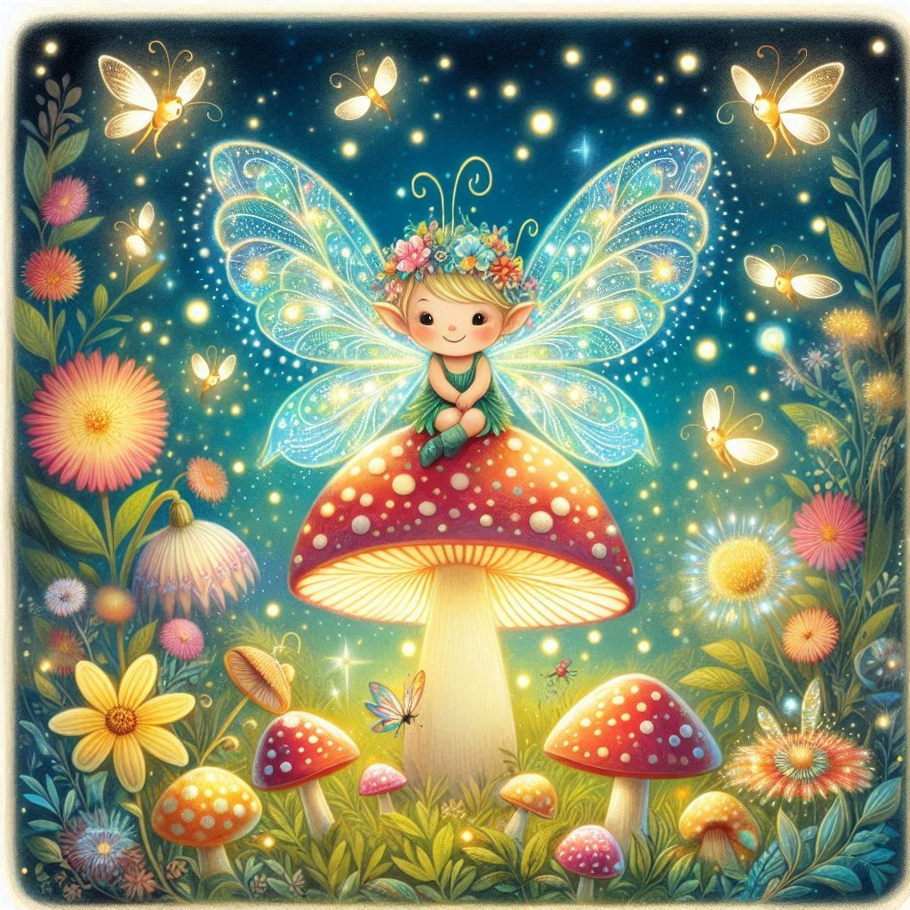

# Resultados do Reconhecimento de Texto

Abaixo estão as imagens criadas pela IA Leonardo.IA, com as descrições geradas pelo Bing. As descrições refletem o que a IA conseguiu identificar sobre os elementos e temas nas imagens.

1. 
   - **Resposta da IA:** "Na imagem, vejo uma cena encantada com um personagem de asas de borboleta sentado em cima de um grande cogumelo. Ao redor, há várias flores, cogumelos menores e insetos voadores que lembram borboletas e vagalumes. O tema central parece ser um cenário de fantasia ou conto de fadas, destacando o encanto da natureza com elementos brilhantes que sugerem magia ou luminescência. O personagem usa uma coroa de flores e tem uma expressão gentil, contribuindo para a atmosfera serena e mágica da imagem. 🌸🧚‍♀️✨"

2. 
   - **Resposta da IA:** "Na imagem, vejo um robô altamente detalhado e realista com uma estrutura humanoide. O design do robô é complexo, com várias partes mecânicas visíveis, incluindo fios, placas e engrenagens. A cabeça do robô possui um olho ou sensor vermelho brilhante no centro, cercado por outros componentes mecânicos intricados. O robô está usando o que parece ser um pano verde esfarrapado ao redor do pescoço, sugerindo alguma forma de individualidade ou caráter. Ao fundo, há estruturas desfocadas que lembram arranha-céus envoltos em chamas e fumaça, indicando uma cena de destruição urbana.
   O tema central desta imagem parece ser ficção científica, focando especificamente no conceito de robótica avançada ou inteligência artificial em um cenário pós-apocalíptico ou devastado pela guerra. 🤖🔥🏙️"

3. 
   - **Resposta da IA:** "Na imagem, vejo um cachorro caramelo com orelhas caídas e expressão amigável, junto com um gato cinza listrado de olhos grandes. Eles estão em um gramado verdejante, cercados por flores coloridas, com uma cerca branca ao fundo. À esquerda, há uma árvore frondosa e, ao longe, uma casa com telhado vermelho.
   O tema central parece ser a amizade entre animais de espécies diferentes, destacando a harmonia e a beleza da natureza. 🌳🐶🐱"
